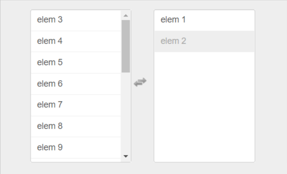

# jQuery multi-select.js

## Summary

- [About](#About)
- [Usage](#Usage)
- [Options](#Options)
- [Methods](#Methods)
- [License](#License)

## About

I'm a user-friendlier drop-in replacement for the standard select with multiple attribute activated.



## Creator

@lou

## Usage

#### HTML

```
<html>
  <head>
    <link href="path/to/multiselect.css" media="screen" rel="stylesheet" type="text/css">
  </head>
  <body>
    <select multiple="multiple" id="my-select" name="my-select[]">
      <option value='elem_1'>elem 1</option>
      <option value='elem_2'>elem 2</option>
      <option value='elem_3'>elem 3</option>
      <option value='elem_4'>elem 4</option>
      ...
      <option value='elem_100'>elem 100</option>
    </select>
    <script src="path/to/jquery.multi-select.js" type="text/javascript"></script>
  </body>
</html>
```

#### JavaScript

```
$('#my-select').multiSelect()
```

## Options


| Name               | type      | default               | description                                                                    |
| -------------------- | ----------- | ----------------------- | -------------------------------------------------------------------------------- |
| afterInit          | function  | function(container){} | Function to call after the multiSelect initilization.                          |
| afterSelect        | function  | function(values){}    | Function to call after one item is selected.                                   |
| afterDeselect      | function  | function(values){}    | Function to call after one item is deselected.                                 |
| selectableHeader   | HTML/Text | null                  | Text or HTML to display in the selectable header.                              |
| selectionHeader    | HTML/Text | null                  | Text or HTML to display in the selection header.                               |
| selectableFooter   | HTML/Text | null                  | Text or HTML to display in the selectable footer.                              |
| selectionFooter    | HTML/Text | null                  | Text or HTML to display in the selection footer.                               |
| disabledClass      | String    | 'disabled'            | CSS class for disabled items.                                                  |
| selectableOptgroup | Boolean   | false                 | Click on optgroup will select all nested options when set to true.             |
| keepOrder          | Boolean   | false                 | The selected items will be displayed in the same order than they are selected. |
| dblClick           | Boolean   | false                 | Replace the defautl click event to select items by the dblclick one.           |
| cssClass           | String    | ""                    | Add a custom CSS class to the multiselect container.                           |
| search             | Boolean   | false                 | Enable search option.                                                          |
| searchBind         | String    | "keyup"               | Replace the defautl input event to search items.                               |

## Methods

#### .multiSelect(options)

Activates your content as a multiselect. Accepts an optional options `object`

```
$('#your-select').multiSelect({});
```

**Note:** You must init the multiple select with $('#your-select').multiSelect() before calling one of the following methods.

#### .multiSelect('select', String|Array)

Select the item with the value given in parameter. The value can be either a string ('elem_1') matching the value of the option oran Array of values (['elem_1', 'elem_42']).

```
$('#your-select').multiSelect('select', String|Array);
```

#### .multiSelect('deselect', String|Array)

Deselect the item with the value given in parameter. The value can be either a string ('elem_1') matching the value of the option oran Array of values (['elem_1', 'elem_42']).

```
$('#your-select').multiSelect('deselect', String|Array);
```

#### .multiSelect('deselect')

Deselect all items previously selected.

```
$('#your-select').multiSelect('select_all');
```

#### .multiSelect('select_all')

Select all elements.

```
$('#your-select').multiSelect('deselect_all');
```

#### .multiSelect('refresh')

Refresh current multiselect.

```
$('#your-select').multiSelect('refresh');
```

#### .multiSelect('addOption', Hash)

Dynamically add option to the multiselect.
The options hash is described bellow:


| key    | type   | required | desription                                                                                |
| -------- | -------- | ---------- | ------------------------------------------------------------------------------------------- |
| value  | String | true     | The value of the option to create                                                         |
| text   | String | true     | The text of the option to create                                                          |
| index  | Number | false    | The index where to insert the option. If none given, it will be inserted as last option.  |
| nested | String | false    | If there are optgroups you can choose under which optgroup you want to insert the option. |

```
$('#your-select').multiSelect('addOption', { 
    value: 'test', 
    text: 'test', 
    index: 0, 
    nested: 'optgroup_label'
});
```

### Keyboard


| key                  | function                                                     |
| ---------------------- | -------------------------------------------------------------- |
| [  ↓  ]  Down arrow | Select next item in the focused list                         |
| [  ↑  ]  Up arrow   | Select previous item in the focused list                     |
| [ — ]  Space        | Add/remove item depending on which list is currently focused |
| [ ← ]  Left arrow   | Focus the previous list                                      |
| [ → ]  Right arrow  | Focus the next list                                          |

## Demos

[http://loudev.com](http://loudev.com "jquery.multi-select.js")

## License

Multi-select is released under the [MIT License](http://opensource.org/licenses/MIT "MIT License").
